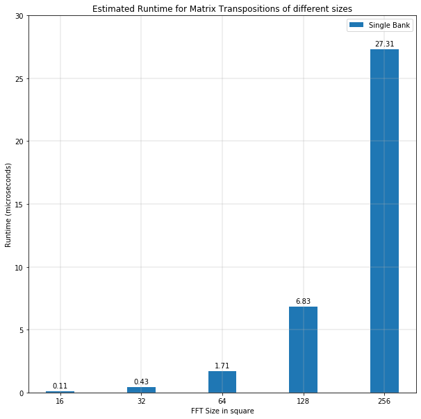
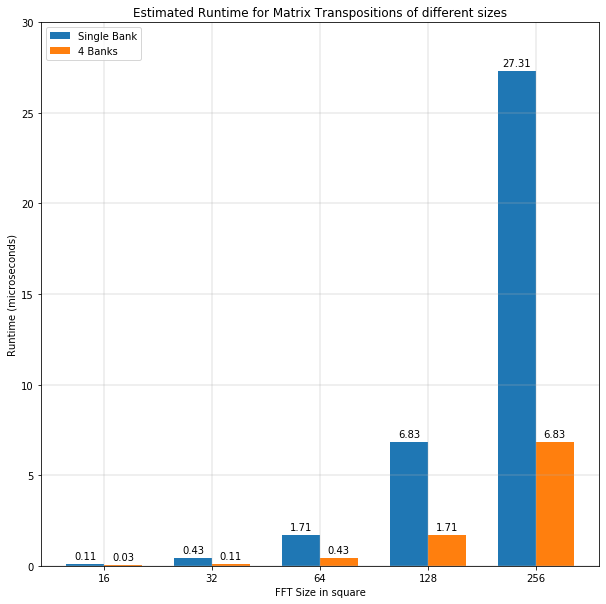

# Matrix Transposition

This repository consists of several experiments to optimize the area for matrix
transposition of 2d square matrices. The aim is to create an efficient in-situ
transposition logic.

## Performance Model

### Theoretical Performance Estimate

Modelling the best performance of a matrix transposition is to model the number of matrices that can be transposed in a given period of time. This can be estimated using **Throughput** i.e., the amount of bits transposed per second.

Assume that there are no stalls in the pipeline and every cycle provides the same amount of data through all the stages of the pipeline. This implies an overlap in computation and memory access stages. Given a large input matrix, the latency of execution and storing data back to memory overlap with fetching the data. Therefore, the amount of bits transposed per second depends on the amount of bits fetched by the FPGA from the global memory i.e. the maximum bandwidth available.

The maximum bandwidth that can be obtained from a single bank of memory is:

    bus_width_bytes = 512 / 8

    memory_controller_frequency = 300 MHz

    max_bandwidth = bus_width_bytes * memory_controller_frequency

                  = 19200.0 MB/s = 19.2 GB/s

    throughput =  max_bandwidth = 19.2GB/sec

The performance of the kernel is now **memory bandwidth bound**. The throughput of all the sizes estimated is *19.2 GB/sec*. This is because of the following reason:

Kernel runs at a frequency larger than the frequency that the data is brought in to the FPGA (memory controller frequency). Considering the memory controller frequency is fixed, enabling more data per cycle to the kernel will increase the performance. This is complemented by the fact that wider pipelines can also be created to consume more data. Thereby, utilizing more banks to provide more data per cycle is an option to overcome the bottleneck.

If 4 banks feed 512 bits data each @300 Mhz, there is a total of 2048 bits available at an effective bandwidth of `19.2 GB/s * 4 = 76.8 GB/s`.

If the kernel continues to consume the same width (of say 512 bits per cycle), the kernel is **compute-bound** i.e, there is sufficient data available but requires more computation. One can nevertheless, see a better performance because the frequency of the kernel is higher than the memory controller and hence will have a higher throughput.

If the kernel uses 4 bank equivalent width, the performance obtained will scale by 4 because of 4 times the bandwidth obtained and the kernel will again be **memory bandwidth bound** with a throughput of *76.8 GB/sec*.

### Latency estimation 

Latency estimation using the maximum bandwidth from above:

#### Single Bank

#### 4 Banks

## TODO

1. Explain why the bus width is 512 along with specifications of the hardware (bus, board)

## Modelling BRAM Usage

Block RAMs in Intel FPGAs are made up of units called M20k blocks, which are  *20480* bits of memory each. The total number of M20k blocks available in each FPGA varies, with the Stratix 10 GX2800 FPGA containing *11721* M20k blocks. This results in the total BRAM memory of *229 Mbits* or *28.6 MB*.

    total_bram = 11721 * 20480 / ((2 ** 20) * 8) # MB

Each BRAM block has a programmable word width of a maximum of *40 bits*. Decreasing the word width increases the number of words that can be stored in the M20k block.  However, with a word width of 40 bits, a total of *512 words* can be stored in a single M20k block. This is also called the **Word Depth**.  

    word_depth = 20480 / 40

The width and thereof, the depth are both programmable.

Therefore, the estimation of BRAM usage is dependent on:

1. Width of data accessed per cycle.
2. Depth.
3. Private Copies
4. Replications
5. Number of banks of local memory

### Width of data accessed

Accessing a data of a particular width defines the minimum number of M20ks required per bank of memory. Storing N complex single precision floats per cycle would require a minimum bank of width *N * 64 bits*. This bank will therefore consist of a minimum of *ceil(N * 64 / 40)* M20k blocks.

    data_type = 32 * 2  # bits; complex sp float
    width = N * 64
    m20_width = 40  # bits
    
    # minimum number of m20ks required to store N data per cycle
    min_num_m20k_reqd_per_bank = ceil(width / m20_width) 
If *N = 8*, this is a minimum of *13* M20k blocks required.

### Bank Depth

Assuming the maximum word width of 40 bits, a depth of a minimum of 512 words can be stored in a single simple dual port M20k block. The depth can be increased in powers of 2 and this consequently reduces the width of the block. For example, if the maximum depth that can be stored in a single M20k block is 2048, the width is reduced to 8 or 10 bits. Similarly, for a depth of 512 bits, the width is either 32 or 40 bits (refer [2.11. Intel Stratix 10 Embedded Memory Configurations](https://www.intel.com/content/dam/www/programmable/us/en/pdfs/literature/hb/stratix-10/ug-s10-memory.pdf)).

**Assumption** (have to clarify)

Let's say, a matrix of `128x128` complex floats has to be stored in BRAMs, with 8 complex floats stored per cycle. This therefore, requires 2048 word depth of data to be stored (`128 * 128 / 8`). Storing this in a single M20k would require using a dual port block with a bit width of 8 or 10 bits. Considering the data type that is used is a complex float value, a struct of two floats, the configuration of m20k that can be used requires a minimum of 32 width and hence a maximum of 512 words depth. Larger depth requires multiplexing multiple M20K blocks, therefore a proportional increase in BRAM usage. In this case, it would require 4 times the M20ks.

    num_words = data_size / num_data_per_cycle 
    min_num_m20k_reqd_per_bank = ceil(port_width / m20_width) * (num_words / bank_depth)

**NOTE** : If the depth required is lesser than 512 words, the M20k configuration is a `512 * 40 bits`. If greater than 512 words, it is `512 * 32 bit` M20ks.

### Private Copies

Private copies are used for simultaneous access of memory by multiple loop iterations in basic blocks. Private copies can be controlled using the *max_concurrency* pragma on the loop, since each iteration scheduled creates private copies of all memory local to its computation.

If word depth is less than 512 and the private copies can fit the m20k block, then they are added to fill the m20k block. Otherwise,

    min_num_m20k_reqd_per_bank = ceil(port_width  * private_copies / m20_width) * (num_words / bank_depth)

The number of private copies are dependent on the loop, the type of kernel (ND Range, SingleWorkItem) and other factors. For not very trivial kernels, expect about:

- 4 private copies for singleworkitem kernels
- 3 private copies for NDrangekernels.

### Replications

Accessing data of a particular width from/to an address makes use of the paricular wide port and the required address to the M20k block. Whereas, accessing data of a particular width from multiple addresses in the same clock cycle requires replications of memory so that these data can be separately "addressed" from distinct M20ks. This is made possible using replications.

An example would be accessing column wise data from a matrix stored in local memory.

    min_num_m20k_reqd_per_bank = ceil(port_width * private_copies / m20_width) * (num_words / bank_depth)  * replications

### Banks

Each bank has different data in same addresses therefore, they occupy completely different m20ks.

    min_num_m20k_used = min_num_m20k_reqd_per_bank * num_banks

### BRAM Estimation

Modelling the amount of BRAM usage is highly dependent on the design and implementation specifics. The next section elaborates on the specific designs and also estimates their respective BRAM usage. The estimation can be approximately calcalated by the following:

    data_width = 512
    if depth < 512 words:
        m20k_width = 40 
        if private copies can fit within the 512 words:
            num_m20k = ceil(data_width / 40) * replications * banks
        else
            num_m20k = ceil(data_width * private_copies / 32) * replications * banks
    
    if depth > 512 words
        m20k_width = 32
        num_m20k = ceil(data_width * private copies / 32) * replications * banks

## Design and Implementation

Each experiment has a distinct branch:

### Simple Naive 2d Transposition

Naive 2d Transposition that writes 8 complex floating points row-wise into local memory and reads 8 complex points column wise from the same memory.

    local float2 buf[N][N];  // buf[N][N] banked on column

    #pragma loop_coalesce
    for(unsigned i = 0; i < N; i++){
      for(unsigned k = 0; k < (N / 8); k++){
        unsigned where_read = k * 8;

        // write into a row of a buffer
        buf[i][where_read + 0] = read_channel_intel(chaninTranspose[0]);
        buf[i][where_read + 1] = read_channel_intel(chaninTranspose[1]);
        // ... 6 more data stored
      }
    }

    #pragma loop_coalesce
    for(unsigned i = 0; i < N; i++){
      for(unsigned k = 0; k < (N / 8); k++){
        unsigned where_write = k * 8;

        // read from column of a buffer
        write_channel_intel(chanoutTranspose[0], buf[where_write + 0][i]);         
        write_channel_intel(chanoutTranspose[1], buf[where_write + 1][i]);   
        // ... 6 more data read
      }
    }

This creates the following:

    say, N = 64
        width = 512 # bits or 64 bytes
        num_words = 64 * 64 * 8 / 64 = 512 
        depth = 512 / 512 = 1
        private_copies = 4   // private copies cannot fit into existing M20k blocks
        replications = 8
        bank = 1
        total_m20k = ceil(512 * 4 / 40) * 1 * 8 * 1 = 416 

    say, N = 128
        width = 512 
        num_words = 128 * 128 * 8 / 64 = 2048
        depth = 2048 / 512 = 4 // depth is larger than 512 words, so width is 32 bits
        private_copies = 4
        replications = 8
        bank = 1
        total_m20k = ceil(512 * 4 / 32) * 4 * 8 * 1 = 2048 

This estimate can provide hints on optimization:

1. Replications use a lot of BRAMs.
2. Store data in different banks to improve performance.

### Banked Transpose

Bank different columns so that there is no need to replicate data.

    local float2 __attribute__((numbanks(N))) buf[N][N];

    say N = 64,
        width = 512
        depth = 64 * 8 / 64 = 8 // every row is stored in another bank
        private copies = 4      // can fit into m20k so no private_copies
        replications = 1
        bank = 64
        total_m20k = ceil(512 / 40) * 1 * 1 * 64 =  832 

Dividing data to N banks is surely not optimal even though performance wise this is better. Instead fill the depth of the BRAMs and reducing the banks, ideally to 8 banks, since only 8 points are read per cycle.

### Diagonal Matrix Transposition

Writes the 8 input points of data into 8 separate banks in a diagonal fashion, so that the reads are also in distinct banks.

    say N = 64,
        width = 64 # 1 point per bank
        depth = 512
        private copies = 4
        replications = 1
        banks = 8
        total_m20k = ceil(64 * 4 / 40) * 1 * 1 * 8 = 56

### Read Before Write

Extension to the diagonal matrix transposition method that is still in progress.

## Comparison

Comparison of BRAM usage between naive and diagonal 2d matrix transpose. The second and third columns show the number of m20k blocks used with the percentage of total m20ks available.

| Matrix Size in cubes | Trivial 2d Transpose | Diagonal 2d Transpose |
|:--------------------:|:--------------------:|:---------------------:|
|          32          |      104 (0.88%)     |          0.43         |
|          64          |      416 (3.5%)      |       56 (0.5%)       |
|          128         |     2048 (17.5%)     |       256 (2.2%)      |
|          256         |      8192 (70%)      |       1024 (8.73%)    |

TODO: Illustration of BRAM savings when used with FFT3d
