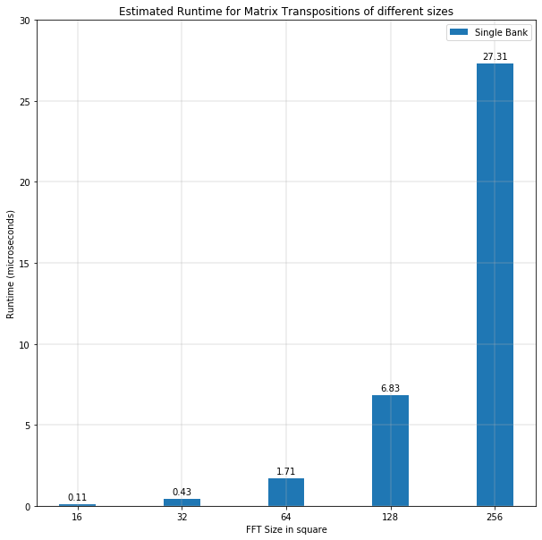

# Performance Model

## Theoretical Performance Estimate

Modelling the best performance of a matrix transposition is to model the number of matrices that can be transposed in a given period of time. This can be estimated using **Throughput** i.e., the amount of bits transposed per second.

Assume that there are no stalls in the pipeline and every cycle provides the same amount of data through all the stages of the pipeline. This implies an overlap in computation and memory access stages. Given a large input matrix, the latency of execution and storing data back to memory overlap with fetching the data. Therefore, the amount of bits transposed per second depends on the amount of bits fetched by the FPGA from the global memory i.e. the maximum bandwidth available.

The maximum bandwidth that can be obtained from a single bank of memory is:

    bus_width_bytes = 512 / 8

    memory_controller_frequency = 300 MHz

    max_bandwidth = bus_width_bytes * memory_controller_frequency

                  = 19200.0 MB/s = 19.2 GB/s

    throughput =  max_bandwidth = 19.2GB/sec

The performance of the kernel is now **memory bandwidth bound**. The throughput of all the sizes estimated is *19.2 GB/sec*. This is because of the following reason:

Kernel runs at a frequency larger than the frequency that the data is brought in to the FPGA (memory controller frequency). Considering the memory controller frequency is fixed, enabling more data per cycle to the kernel will increase the performance. This is complemented by the fact that wider pipelines can also be created to consume more data. Thereby, utilizing more banks to provide more data per cycle is an option to overcome the bottleneck.

If 4 banks feed 512 bits data each @300 Mhz, there is a total of 2048 bits available at an effective bandwidth of `19.2 GB/s * 4 = 76.8 GB/s`.

If the kernel continues to consume the same width (of say 512 bits per cycle), the kernel is **compute-bound** i.e, there is sufficient data available but requires more computation. One can nevertheless, see a better performance because the frequency of the kernel is higher than the memory controller and hence will have a higher throughput.

If the kernel uses 4 bank equivalent width, the performance obtained will scale by 4 because of 4 times the bandwidth obtained and the kernel will again be **memory bandwidth bound** with a throughput of *76.8 GB/sec*.

## Latency estimation

Latency estimation using the maximum bandwidth from above:

### Single Bank

### 4 Banks

